```
Advisory ID   R0G-0001                     First published   2019-XX-XX
Status        Active, no patch planned     Last revised      2026-09-07
TLP           CLEAR                        Revision          3.1
```

## Summary

A penetration tester who ended up on the other side of the report. I break web
applications and operating systems for a living, and then spend the rest of the
week deciding what the findings are actually worth — scoring them, arguing about
the scoring, and publishing the advisory that comes out the other end.

Most of my work happens in product security for industrial software: intake,
triage, CVSS adjudication between teams who disagree, and CSAF 2.0 advisories
that have to be right the first time because customers automate against them.


## Affected components

| Component | Exposure | Notes |
|---|---|---|
| Web application VAPT | Network, unauthenticated | Authn/authz flaws, injection, session handling, business logic |
| OS-level VAPT | Local and remote | Privilege escalation, service misconfiguration, hardening review |
| Vulnerability management | Continuous | Intake, triage, SLA tracking, pipeline automation |
| CVSS 4.0 adjudication | Independent arbiter | Metric-by-metric justification against the FIRST specification |
| CSAF 2.0 authoring | Machine-readable output | JSON as single source of truth; Word, PDF and HTML derive from it |
| Home lab | Air-gapped, intentionally vulnerable | Where the reckless things happen |

## Technical details

I care about the part most people skip: whether the score is defensible. An
"AV:N/PR:N" on a finding that needs a foothold and a coin flip is not a critical,
and a low that quietly breaks safety instrumentation is not a low. When two teams
disagree, the vector has to be argued metric by metric against the specification
language, not vibes — and then written down so the next person can audit the call.

On the automation side, the rule I keep coming back to: one source of truth, every
format generated from it. Advisories drift the moment a human retypes a CVE ID
into a second document.

<details>
<summary><b>Toolchain</b></summary>

```
recon        subfinder · httpx · katana · naabu · nuclei
web          Burp Suite · OWASP ZAP · ffuf · gobuster · sqlmap · dalfox · nikto · wpscan
wordlists    seclists · wfuzz
scoring      CVSS 4.0 (FIRST spec + examples) · CWE · CSAF 2.0
tracking     Jira · custom Python pipelines · pandas
lab          Kali ARM64 on a Raspberry Pi 5 · OWASP Juice Shop · deliberately broken VMs
writing      Python · python-docx · a suspicious amount of regex
```
</details>

<details>
<summary><b>Currently working on</b></summary>

- CSAF-first advisory tooling: one JSON in, four publishable formats out
- Automating the boring half of vulnerability intake so the interesting half gets attention
- A portable ARM64 testing rig that fits in a bag and still runs a full web assessment
- Getting better at explaining risk to people who do not think in vectors

</details>


## Proof of concept

```console
$ whoami
analyst, tester, and the person who says "that is a medium, not a critical"

$ cat /etc/motd
Reports are the deliverable. The exploit is just how you earn the right to write one.

$ sudo -l
(ALL) NOPASSWD: /usr/bin/read-the-spec-again
```

## Mitigations

No patch is available. The following compensating controls are recommended:

- Validate input on the server, not in the browser
- Rotate the credential that has been in that repository since 2021
- Segment the network you have described as "flat but it's fine"
- Read the advisory before the CVSS score

## Scope and rules of engagement

Everything published here is built for authorised testing only: signed engagements,
your own systems, or legal practice environments. Nothing in these repositories is
intended to be pointed at infrastructure you do not have written permission to touch.


## Contact

Coordinated disclosure and work enquiries welcome. Reach me here, or through the
address on my profile.

```
Acknowledgements   every developer who took a finding well
Credits            R0gue-Pineapple · Tech and DJ · Openformat
```
